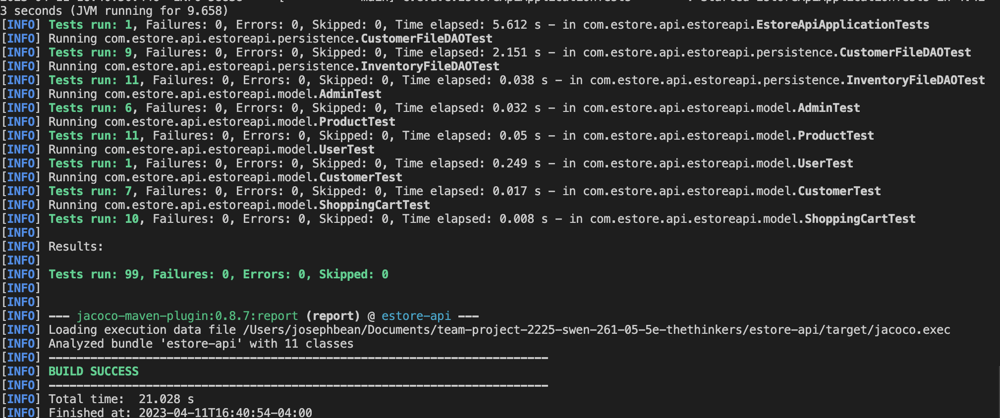

# PROJECT Design Documentation

## Team Information
* Team name: The Thinkers
* Team members
  * Ivan Kutovoi
  * Zhi Xin Chen
  * Joseph Bean
  * Arhaan Singh
  * Cory Zeitz

## Executive Summary

This is a summary of the project.

### Purpose
>  _**[Sprint 4]** Provide a very brief statement about the project and the most
> important user group and user goals (Sprint 4)._
This project is a Web application for a game shop. 

### Glossary and Acronyms
> _**[Sprint 2 & 4]** Provide a table of terms and acronyms._

| Term | Definition |
|------|------------|
| SPA  | Single Page|

## Requirements

This section describes the features of the application.

> _In this section you do not need to be exhaustive and list every
> story.  Focus on top-level features from the Vision document and
> maybe Epics and critical Stories._

### Definition of MVP
> _**[Sprint 4]** Provide a simple description of the Minimum Viable Product.
  The minimal viable product includes the basic functionality for the customers and admin. Users can login as customers or the admin. The admin should be able to make changes to the inventory, the customer should be able to browse and purchase products, and the system should
  save all of the inventory and user information. 

### MVP Features
>  _**[Sprint 4]** Provide a list of top-level Epics and/or Stories of the MVP._
Customer Functionality:
    Browse Products - Customers should be able to see a list of available products from the inventory
    Search for Products - Customers should also be able to search the product list with a keyword to find a specific product
    Add/Remove Items in the Shopping Cart - Customers should be able to add items to and remove them from their personal shopping cart
Admin Functionality:
    Add/Remove Items: The admin should be able to add new products to the inventory and remove existing ones
    Edit Inventory - The admin should be able to edit the prices and stock of products in the inventory
System Functionality:
    Information Preserved - Information such as the customer shopping carts or the admin inventory changes should be saved between sessions

### Enhancement
> _**[Sprint 4]** Describe what enhancements you have implemented for the project._
The enhancement feature is the trade offers that the customers can make to the admin. The customers are able to trade in their products to the store in exhange for store credit to be used when buying other items. The admin can then decide if they want to accept or deny the offers.

### Enhancement Features
> _**[Sprint 4]** Describe the features of the enhancement you have implemented for the project._
The customers are able to trade in their products to the store in exchange for store credit. They can make the trade offer by entering the product name and value. They can then check in on their offer to see the status as either accepted, pending, or denied. If accepted, the store credit will be added to their account and they can apply it at checkout. The admin is able to see all of the offers and accept or deny them.

## Application Domain

This section describes the application domain.

> _**[Sprint 2 & 4]** Provide a high-level overview of the domain for this application. You
> can discuss the more important domain entities and their relationship
> to each other._

## Architecture and Design

This section describes the application architecture.

### Summary

The following Tiers/Layers model shows a high-level view of the webapp's architecture.

The e-store web application, is built using the Model–View–ViewModel (MVVM) architecture pattern. 

The Model stores the application data objects including any functionality to provide persistance. 

The View is the client-side SPA built with Angular utilizing HTML, CSS and TypeScript. The ViewModel provides RESTful APIs to the client (View) as well as any logic required to manipulate the data objects from the Model.

Both the ViewModel and Model are built using Java and Spring Framework. Details of the components within these tiers are supplied below.

### Overview of User Interface

This section describes the web interface flow; this is how the user views and interacts
with the e-store application.

> _Provide a summary of the application's user interface.  Describe, from
> the user's perspective, the flow of the pages in the web application._

### View Tier
> _**[Sprint 4]** Provide a summary of the View Tier UI of your architecture.
> Describe the types of components in the tier and describe their
> responsibilities.  This should be a narrative description, i.e. it has
> a flow or "story line" that the reader can follow._

> _**[Sprint 4]** You must  provide at least **2 sequence diagrams** as is relevant to a particular aspects 
> of the design that you are describing.  For example, in e-store you might create a 
> sequence diagram of a customer searching for an item and adding to their cart. 
> As these can span multiple tiers, be sure to include an relevant HTTP requests from the client-side to the server-side 
> to help illustrate the end-to-end flow._

> _**[Sprint 4]** To adequately show your system, you will need to present the **class diagrams** where relevant in your design. Some additional tips:_
 >* _Class diagrams only apply to the **ViewModel** and **Model** Tier_
>* _A single class diagram of the entire system will not be effective. You may start with one, but will be need to break it down into smaller sections to account for requirements of each of the Tier static models below._
 >* _Correct labeling of relationships with proper notation for the relationship type, multiplicities, and navigation information will be important._
 >* _Include other details such as attributes and method signatures that you think are needed to support the level of detail in your discussion._

### ViewModel Tier
> _**[Sprint 4]** Provide a summary of this tier of your architecture. This
> section will follow the same instructions that are given for the View
> Tier above._

> _At appropriate places as part of this narrative provide **one** or more updated and **properly labeled**
> static models (UML class diagrams) with some details such as critical attributes and methods._
> 

### Model Tier
> _**[Sprint 2, 3 & 4]** Provide a summary of this tier of your architecture. This
> section will follow the same instructions that are given for the View
> Tier above._

> _At appropriate places as part of this narrative provide **one** or more updated and **properly labeled**
> static models (UML class diagrams) with some details such as critical attributes and methods._
> 

## OO Design Principles
> _**[Sprint 2, 3 & 4]** Discuss at least **4 key OO Principles** in your current design. This should be taken from your work in "Adherence to Architecture and Design Principles" that you have completed in a previous Sprint. Be sure to include any diagrams (or clearly refer to ones elsewhere in your Tier sections above) to support your claims._

Single Responsibility: The classes that we use only have a single responsibility. InventoryController is responsible for managing the API and networking. To do this, it uses InventoryDAO or, specifically, InventoryDileDAO. This class is responsible for managing the file used for information storage. The product is also a separate class with only getters and setters. 

Open / Closed principle: We follow this principle by using the InventoryDAO interface. Another example is our old Product class design: we used to have a Category enumeration used to separate products. We did not use that idea because it didn't adhere to this principle.
Low coupling: The design of the video game store used low coupling to communicate packages with the REST API managing the product systems packages. The product system contained a model, a controller, and a persistence package. The model package includes the product class, which contains information about every product, such as the price, name, and quantity. The controller package contains the inventory controller, which allows sending an HTTP request based on what is happening in the inventory management system. The persistence package contains the inventoryDAO and the inventoryFileDAO. The inventoryDAO is the interface that includes methods used for inventory management. The inventoryFileDAO is the class that implements the inventoryDAO and writes it to a JSON file. These packages do not rely on each other but rather help each other do each task; the packages to make each class have single responsibility that the REST API will then couple. 

Law Of Demeter: In object-oriented programming, the law of Demeter means that an object should only be able to access a method from one object instance and not access another object through another. This reduces the dependency of one object on other and allows changes to be made with a limited reworking of other objects and callers. This makes it easier to edit a class without having to change the logic of other classes or their method calls. This also removes the need for objects using secondary methods from objects returned by other methods. In our project, this could be implemented with regard to the products. The customer can access a list of products so they can search for them and add them to their cart. The Admin can edit the inventory which in turn edits the product list but the customer can’t access the methods to edit as the Admin can. This would prevent unwanted interference with the inventory and eliminates connections between customer and Admin functionality while still being able to interact with the same list of products.

 Controller: The Controller is one of the core components of the Persistence model that we are utilizing in our design. The Model consists of the core data type class; While the Persistence portion is used to collect the core data type and the functions to modify this collection. The View is the visual representation of the Model, which receives the data to display from the controller. The view also takes input from the user and sends this input to the controller. The controller processes the input from the view and calls functions from the persistence portion to modify the collection of data being displayed. Utilizing a controller in design is beneficial as it makes an application stateless, which means there is no reliance on dedicated backing storage. This serves to make an application more versatile and provides further decoupling. In our design, we utilize the design principle of the controller in the form of the InventoryController class. The Inventory Controller is set to receive input from our Angular View Component via HTTP. The controller then calls functions from the Persistence portion of the model via the DAO interface to modify the inventory or return a value to the view. After performing the specified operation the controller sends the data (if data is specified) to the view with the appropriate HTTP status code. 

> _**[Sprint 3 & 4]** OO Design Principles should span across **all tiers.**_

## Static Code Analysis/Future Design Improvements
> _**[Sprint 4]** With the results from the Static Code Analysis exercise, 
> **Identify 3-4** areas within your code that have been flagged by the Static Code 
> Analysis Tool (SonarQube) and provide your analysis and recommendations.  
> Include any relevant screenshot(s) with each area._

> _**[Sprint 4]** Discuss **future** refactoring and other design improvements your team would explore if the team had additional time._

## Testing
> _This section will provide information about the testing performed
> and the results of the testing._

### Acceptance Testing
> _**[Sprint 2 & 4]** Report on the number of user stories that have passed all their
> acceptance criteria tests, the number that have some acceptance
> criteria tests failing, and the number of user stories that
> have not had any testing yet. Highlight the issues found during
> acceptance testing and if there are any concerns._

### Unit Testing and Code Coverage
> _**[Sprint 4]** Discuss your unit testing strategy. Report on the code coverage
> achieved from unit testing of the code base. Discuss the team's
> coverage targets, why you selected those values, and how well your
> code coverage met your targets._

>_**[Sprint 2 & 4]** **Include images of your code coverage report.** If there are any anomalies, discuss
> those._

